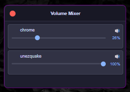

# Windows Volume Mixer

A sleek, compact volume mixer application for Windows that allows you to control the volume of individual applications with precision. This lightweight utility provides an elegant alternative to the built-in Windows volume mixer, with a focus on minimalism and usability.

<div align="center">
  
  <p><em>Screenshot: The Volume Mixer application showing individual application volume controls with a custom dark theme and macOS-style window controls.</em></p>
</div>

## Features

- **Individual Volume Control**: Precisely adjust volume levels for each application independently
- **Mute/Unmute Toggle**: Quickly silence or restore audio for specific applications with a single click
- **Real-time Updates**: Automatically refreshes every 2 seconds to detect new audio sessions
- **Elegant Dark Theme**: Modern, eye-friendly dark interface with carefully selected color palette
- **Adaptive Window Size**: Window automatically resizes based on the number of active applications
- **Custom Window Frame**: Borderless window with custom title bar and macOS-inspired controls
- **Application Icons**: Visual identification with app icons displayed next to each volume slider
- **Minimal Footprint**: Lightweight design that uses minimal system resources
- **No Scrollbars**: Clean interface that adjusts to show all content without scrolling
- **Intuitive Controls**: Simple, straightforward sliders and buttons for easy audio management

## Technology Stack

This application leverages modern technologies to provide a seamless experience:

### Frontend
- **[React](https://reactjs.org/)**: A JavaScript library for building user interfaces
- **CSS3**: Custom styling with modern CSS features
- **[Vite](https://vitejs.dev/)**: Next-generation frontend tooling for faster development

### Backend
- **[Rust](https://www.rust-lang.org/)**: Systems programming language that offers performance, reliability, and productivity
- **[winmix](https://crates.io/crates/winmix)**: Rust crate for Windows audio session control
- **Windows Core Audio API**: Low-level access to Windows audio subsystem

### Framework
- **[Tauri](https://tauri.app/)**: Framework for building tiny, blazingly fast binaries for all major desktop platforms
  - Smaller application size compared to Electron
  - Lower memory consumption
  - Native system integration

## Installation

### For Users

#### Method 1: Download the Installer
1. Go to the [Releases](https://github.com/yourusername/windows-volume-mixer/releases) page
2. Download the latest `.msi` installer file
3. Run the installer and follow the on-screen instructions
4. Launch "Volume Mixer" from your Start menu

#### Method 2: Portable Version
1. Download the `.exe` file from the [Releases](https://github.com/yourusername/windows-volume-mixer/releases) page
2. Place it in your preferred location
3. Double-click to run (no installation required)

### For Developers

#### Prerequisites

- Windows 10 or later
- [Rust](https://www.rust-lang.org/tools/install) (1.60 or later)
- [Node.js](https://nodejs.org/) (v16 or later)
- [Git](https://git-scm.com/downloads)

#### Development Setup

1. Clone the repository:
   ```bash
   git clone https://github.com/yourusername/windows-volume-mixer.git
   cd windows-volume-mixer
   ```

2. Install dependencies:
   ```bash
   npm install
   ```

3. Run the development version:
   ```bash
   npm run tauri dev
   ```
   This will start the application in development mode with hot-reload.

4. Build for production:
   ```bash
   npm run tauri build
   ```
   This creates an installer in `src-tauri/target/release/bundle`.

## Usage Guide

### Basic Controls

When you launch the Volume Mixer, it automatically detects all applications currently playing audio:

<div align="center">
  
</div>

For each application detected:

- **Volume Slider**: Drag left or right to decrease or increase volume
- **Mute Button**: Click the speaker icon (🔊) to toggle mute/unmute (changes to 🔇 when muted)
- **Application Name**: Displayed alongside the application's icon for easy identification

### Window Management

- **Move Window**: Click and drag the title bar to reposition the mixer
- **Close Application**: Click the red button in the top-left corner
- **Auto-sizing**: The window automatically adjusts its height as applications are added or removed

### Tips & Tricks

- **Quick Mute All**: Quickly mute all applications by closing and reopening the mixer with all apps muted
- **Background Updates**: The mixer automatically refreshes every 2 seconds to detect new audio sessions
- **System Tray**: The application can be minimized to the system tray for easy access (coming soon)

## Design Philosophy

The Volume Mixer was designed with the following principles in mind:

### Aesthetic Principles

- **Minimalist Dark Theme**: Reduces eye strain and provides a modern look
- **Compact Layout**: Maximizes functionality while minimizing screen space usage
- **Visual Hierarchy**: Important controls are immediately accessible
- **Consistent Design Language**: Uniform styling throughout the application

### User Experience

- **Intuitive Controls**: Familiar slider interface requires no learning curve
- **Responsive Design**: Window adapts to content without scrollbars
- **Visual Feedback**: Clear indication of mute states and volume levels
- **Accessibility**: High contrast elements for better readability

### Technical Design

- **Efficient Resource Usage**: Minimal CPU and memory footprint
- **Native Integration**: Seamless interaction with Windows audio subsystem
- **Modular Architecture**: Clean separation between UI and audio control logic

## Development

### Project Structure

- `src/` - React frontend code
- `src-tauri/` - Rust backend code
  - `src/lib.rs` - Main Rust code
  - `src/volume_mixer.rs` - Audio session handling

### Building from Source

Follow the installation instructions above. The `npm run tauri build` command will create an installer in the `src-tauri/target/release/bundle` directory.

## License

[MIT License](LICENSE)

## Acknowledgements

- [Tauri](https://tauri.app/) for the framework
- [winmix](https://crates.io/crates/winmix) for Windows audio session control
